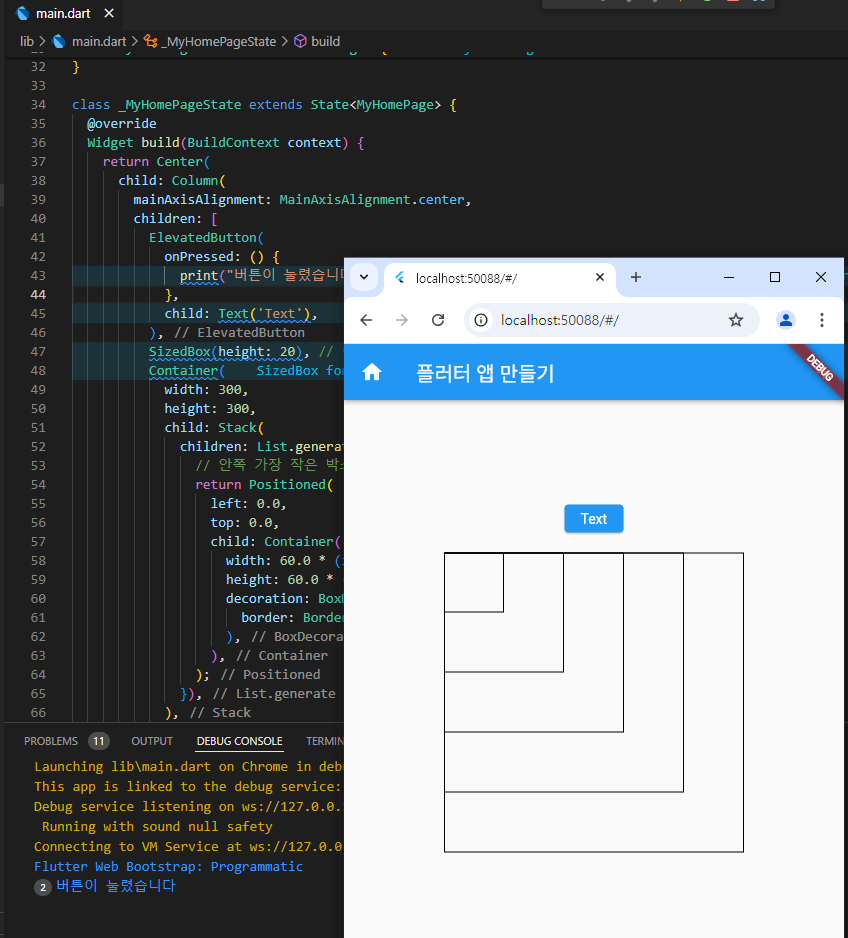

# AIFFEL Campus Online Code Peer Review Templete
- 코더 : 강윤제
- 리뷰어 : 김우찬


# PRT(Peer Review Template)
- [x]  **1. 주어진 문제를 해결하는 완성된 코드가 제출되었나요?**
    - 이미지에 적혀있는대로 과제가 잘 완성되었습니다.
    - 또한, Text 버튼 눌렀을 때 버튼이 눌렸습니다와 같은 디버깅도 잘 확인되었습니다.
    - 제꺼와의 차이는, Text 버튼에 색을 추가로 입히셨다는 것입니다. 잘 완성되었습니다.
        - 

    
- [x]  **2. 전체 코드에서 가장 핵심적이거나 가장 복잡하고 이해하기 어려운 부분에 작성된 
주석 또는 doc string을 보고 해당 코드가 잘 이해되었나요?**
    - 특별히 코드상 불필요한 부분은 없었던 것 같습니다.
    - GPT 사용 후 수정하는 과정을 거치셨던 부분에 대해 잘 설명해주셨습니다.
        
- [x]  **3. 에러가 난 부분을 디버깅하여 문제를 해결한 기록을 남겼거나
새로운 시도 또는 추가 실험을 수행해봤나요?**
    - 제가 프로젝트 도중에 회고를 작성하고 있는 상황이라, 최종 결과물에 대해 이야기는 듣지 못하였지만, 윤제님께서 도중에 추가작업을 진행하고 계십니다.
    - 잘 완성된 프로젝트에서 추가적으로 수정하는과정을 거치고 계신 것이 인상적입닏가.
    - 어제 윤제님이 개인적인 사정으로 참석하지 못한 상태에서 과제에 임하여서, GPT를 사용하였다고 말씀하셨는데, GPT 사용 후 제대로 나오지 않았던 부분에 대해 추가적인 작업으로 수정하였던 것에 대해 구두로 말씀해주셨습니다.
          - 컨테이너가 우측으로 몰려있던 부분에 대해 추가적인 코드수정을 하였고, 원하는 결과물을 얻으셨습니다.
        
- [x]  **4. 회고를 잘 작성했나요?**
    - 제가 오늘 조퇴를 해야해서 급하게 PRT를 진행하느라, 윤제님이 회고를 작성하기 전에 파일을 수정하고 잇습니다. 구두로 GPT 사용하였을 시 문제에 대해 말씀하셨고, 수정해서 최종 결과물을 얻은 부분에 대해 저녁에 한번 더 확인하여 회고를 작성하겠습니다.
        
- [x]  **5. 코드가 간결하고 효율적인가요?**
    - 특별히 길지 않고, 제가 보기엔 충분히 효율적인 코드라고 생각합니다.
      - 


# 회고(참고 링크 및 코드 개선)
```
# 리뷰어의 회고를 작성합니다.
# 김우찬 : 코드를 잘 작성해주셨습니다. 제 코드와 특별한 차이는 보이지 않았던 것 같습니다. 추가적인 코드작업 후 결과물에 대해서는 금일 저녁에 한번 더 확인하고 회고에 적겠습니다. 고생 많으셨습니다.
# 코드 리뷰를 통해 개선한 코드가 있다면 코드와 간략한 설명을 첨부합니다.
```
